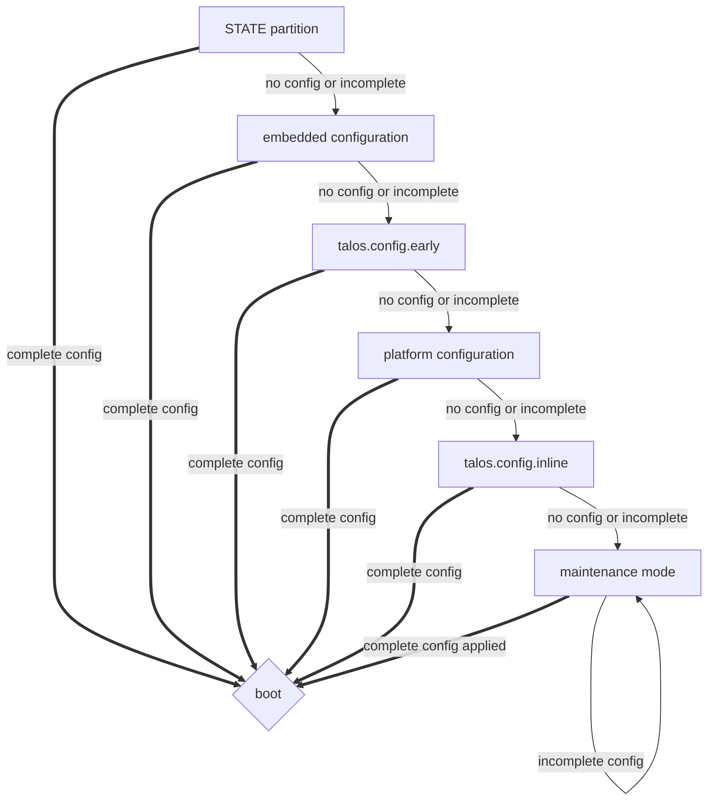

Talos Linux requires a [machine configuration]() to operate. This configuration can be provided in several ways, depending on your deployment method and environment.

## Methods of Acquiring Machine Configuration

Talos checks for machine configuration in the following order:

> Note: If multiple methods are used, each new method **overwrites** the machine configuration acquired from the previous method.

### `STATE` partition

When Talos is installed on a disk, it creates a `STATE` partition. This partition is used to store the machine configuration and other stateful data. During the boot process, Talos checks this partition for a valid configuration file.

### Platform Configuration

For cloud and virtualized environments, Talos can acquire its configuration from platform-specific metadata services. This includes:

- AWS EC2 Instance Metadata Service
- Azure Instance Metadata Service
- Google Cloud Metadata Service
- OpenStack Metadata Service
- ... and others.

For the `metal` platform, Talos can download machine configuration from a specified URL (kernel argument [`talos.config`]()).

### Kernel Arguments

Talos can also accept machine configuration documents directly via kernel arguments [`talos.config.early` and `talos.config.inline`](). This method is particularly useful for initial bootstrapping, e.g. specifying a custom set of [trusted CAs]().

### Embedded Configuration

Talos supports embedding the machine configuration directly into the bootable image (ISO, USB, `installer`).
This is done using the [Imager tool]().
When the system boots, it reads the embedded configuration.

### Maintenance Mode

As the last resort, if the machine configuration is still incomplete for a full boot, Talos will drop into [maintenance mode]().

## Examples

### Bare-metal with DHCP

If the machine is booted with Talos on bare-metal and the environment provides DHCP automatic network configuration, no initial configuration is needed.
If Talos is already installed, it will boot using the configuration from the `STATE` partition.
If Talos is not installed, it will attempt to acquire configuration from either from the platform (Talos downloads configuration from `talos.config` URL), or drop into maintenance mode (an operator applies configuration via API).

### Bare-metal with static IP

The initial configuration must be provided via either embedded configuration, `talos.config.early` kernel argument, or embedding the configuration into the bootable image.
If Talos is already installed, it will boot using the configuration from the `STATE` partition.
If Talos is not installed, it will apply initial static network configuration,
and then attempt to acquire the rest of the configuration either from the platform (Talos downloads configuration from `talos.config` URL), or drop into maintenance mode (an operator applies configuration via API).

### `nocloud` platform

Talos will configure networking automatically using metadata provided via the `nocloud` platform.
Machine configuration might be provided via `nocloud` user-data, or Talos will drop into maintenance mode (an operator applies configuration via API).
Also partial initial machine configuration (e.g. custom trusted CAs) might be provided via `nocloud` user-data, and the rest of the configuration will be acquired via the push method (API).

## Omni

When using [Omni](https://siderolabs.com/omni), Talos machine initial configuration enables [SideroLink]() connection to Omni.
Omni will then push the full machine configuration to Talos via the API.
When SideroLink is enabled, Talos maintenance service is limited to SideroLink only.

Initial configuration can be provided using any of the methods described above.
Minimum initial configuration can be downloaded from Omni, but it must include [SideroLink configuration]().

Additional bootstrap configuration (as needed) can be provided to configured trusted roots, static network configuration, etc. based on the deployment environment:

- for example, on AWS it might be stored in the instance user-data (platform configuration)
- on bare-metal it might be embedded into the bootable image (embedded configuration)
