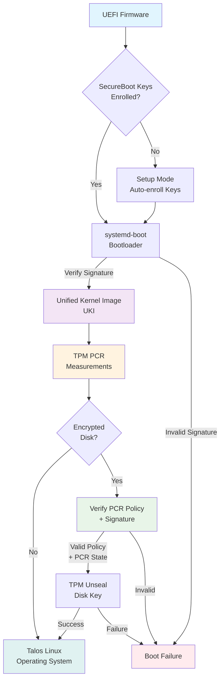

Talos supports booting on UEFI systems in SecureBoot mode.
When combined with TPM-based disk encryption, this provides a complete [Trusted Boot](https://0pointer.net/blog/brave-new-trusted-boot-world.html) experience where the entire boot chain is cryptographically verified.

This means the disk will only unlock if SecureBoot remains enabled with the same key set when using the default PCR 7 binding. However, **PCR binding is fully configurable** via the `VolumeConfig` `tpm.pcrs` option - see the [TPM encryption options]() for details.

## **PCR Binding Options**

- **Default**: PCR 7 (SecureBoot state) + PCR 11 signed policy (UKI measurements and boot phases)
- **Configurable**: Any combination of PCRs can be specified
- **No PCRs**: Can be disabled by passing an empty list, relying solely on PCR 11 signed policy
- **Backward compatibility**: Existing installations continue to use their original PCR binding

**Why Configurable PCRs?**

- **Frequent Updates**: PCR 7 covers the SecureBoot policy, particularly the "dbx" denylist of revoked certificates
- **Automatic Updates**: Tools like `fwupd` now automatically update the SecureBoot database, causing PCR 7 to change frequently
- **Brittleness**: Literal PCR 7 policies break when firmware or SecureBoot databases are updated, even without policy changes

Talos maintains PCR 7 binding by default for backward compatibility, but users can now choose configurations that better suit their update policies and security requirements.

When the UKI image is generated, the UKI is measured and expected measurements are combined into TPM unlock policy and signed with the PCR signing key. This provides [Trusted Boot](https://0pointer.net/blog/brave-new-trusted-boot-world.html) experience.

> Note: SecureBoot is not supported on x86 platforms in BIOS mode.

## SecureBoot Flow

The SecureBoot process follows a strict verification chain from UEFI firmware to the final operating system:



The implementation is using [systemd-boot](https://www.freedesktop.org/wiki/Software/systemd/systemd-boot/) as a boot menu implementation, while the
Talos kernel, initramfs and cmdline arguments are combined into the [Unified Kernel Image](https://uapi-group.org/specifications/specs/unified_kernel_image/) (UKI) format.
UEFI firmware loads the `systemd-boot` bootloader, which then loads the UKI image.
Both `systemd-boot` and Talos `UKI` image are signed with the key, which is enrolled into the UEFI firmware.

As Talos Linux is fully contained in the UKI image, the full operating system is verified and booted by the UEFI firmware.

> Note: There is no support at the moment to upgrade non-UKI (GRUB-based) Talos installation to use UKI/SecureBoot, so a fresh installation is required.

## SecureBoot with Sidero Labs Images

[Sidero Labs](https://www.siderolabs.com/) provides Talos images signed with the [Sidero Labs SecureBoot key](https://factory.talos.dev/secureboot/signing-cert.pem) via [Image Factory]().

> Note: The SecureBoot images are available for Talos releases starting from `v1.5.0`.

The easiest way to get started with SecureBoot is to download the [ISO](https://factory.talos.dev/image/376567988ad370138ad8b2698212367b8edcb69b5fd68c80be1f2ec7d603b4ba//metal-amd64-secureboot.iso), and
boot it on a UEFI-enabled system which has SecureBoot enabled in setup mode.

The ISO bootloader will enroll the keys in the UEFI firmware, and boot the Talos Linux in SecureBoot mode.
The install should performed using SecureBoot installer (put it Talos machine configuration): `factory.talos.dev/installer-secureboot/376567988ad370138ad8b2698212367b8edcb69b5fd68c80be1f2ec7d603b4ba:`.

> Note: SecureBoot images can also be generated with [custom keys](#secureboot-with-custom-keys).

## Booting Talos Linux in SecureBoot Mode

In this guide we will use the ISO image to boot Talos Linux in SecureBoot mode, followed by submitting machine configuration to the machine in maintenance mode.
We will use one the ways to generate and submit machine configuration to the node, please refer to the [Production Notes]() for the full guide.

First, make sure SecureBoot is enabled in the UEFI firmware.
For the first boot, the UEFI firmware should be in the setup mode, so that the keys can be enrolled into the UEFI firmware automatically.
If the UEFI firmware does not support automatic enrollment, you may need to hit Esc to force the boot menu to appear, and select the `Enroll Secure Boot keys: auto` option.

> Note: There are other ways to enroll the keys into the UEFI firmware, but this is out of scope of this guide.

Once Talos is running in maintenance mode, verify that secure boot is enabled:

```shell
$ talosctl -n <IP> get securitystate --insecure
NODE   NAMESPACE   TYPE            ID              VERSION   SECUREBOOT
       runtime     SecurityState   securitystate   1         true
```

Now we will generate the machine configuration for the node supplying the `installer-secureboot` container image, and applying the patch to enable TPM-based [disk encryption]() (requires TPM 2.0):

```yaml
# tpm-disk-encryption.yaml
machine:
  systemDiskEncryption:
    ephemeral:
      provider: luks2
      keys:
        - slot: 0
          tpm: {}
    state:
      provider: luks2
      keys:
        - slot: 0
          tpm: {}
```

Generate machine configuration:

```shell
talosctl gen config <cluster-name> https://<endpoint>:6443 --install-image=factory.talos.dev/installer-secureboot/376567988ad370138ad8b2698212367b8edcb69b5fd68c80be1f2ec7d603b4ba: --install-disk=/dev/sda --config-patch @tpm-disk-encryption.yaml
```

Apply machine configuration to the node:

```shell
talosctl -n <IP> apply-config --insecure -f controlplane.yaml
```

Talos will perform the installation to the disk and reboot the node.
Please make sure that the ISO image is not attached to the node anymore, otherwise the node will boot from the ISO image again.

Once the node is rebooted, verify that the node is running in secure boot mode:

```shell
talosctl -n <IP> --talosconfig=talosconfig get securitystate
```

## Upgrading Talos Linux

Any change to the boot asset (kernel, initramfs, kernel command line) requires the UKI to be regenerated and the installer image to be rebuilt.
Follow the steps above to generate new installer image updating the boot assets: use new Talos version, add a system extension, or modify the kernel command line.
Once the new `installer` image is pushed to the registry, [upgrade]() the node using the new installer image.

It is important to preserve the UKI signing key and the PCR signing key, otherwise the node will not be able to boot with the new UKI and unlock the encrypted partitions.

## Disk Encryption with TPM

When encrypting the disk partition for the first time, Talos Linux generates a random disk encryption key and seals (encrypts) it with the TPM device.
The TPM unlock policy is configured to trust the expected policy signed by the PCR signing key.
This way TPM unlocking doesn't depend on the exact [PCR measurements](https://uapi-group.org/specifications/specs/linux_tpm_pcr_registry/), but rather on the expected policy signed by the PCR signing key and the configured PCR states (by default includes PCR 7 for SecureBoot status and the list of enrolled keys, plus PCR 11 for boot integrity).

### PCR Measurements in Detail

The Unified Kernel Image (UKI) boot process involves several measurement stages that record cryptographic hashes into TPM Platform Configuration Registers (PCRs):

#### systemd-stub UKI Measurements (PCR 11)

According to the [UAPI Unified Kernel Image specification](https://uapi-group.org/specifications/specs/unified_kernel_image/) and [systemd-stub documentation](https://www.freedesktop.org/software/systemd/man/latest/systemd-stub.html), systemd-stub measures the following UKI sections into **PCR 11**:

- **`.linux` section** - The Linux kernel binary (PE section containing the ELF kernel image, required)
- **`.osrel` section** - OS release information (PE section with `/etc/os-release` contents)
- **`.cmdline` section** - The kernel command line arguments (PE section with embedded cmdline)
- **`.initrd` section** - The initial ramdisk image (PE section containing initramfs)
- **`.ucode` section** - Microcode initrd (PE section with CPU microcode updates, uncompressed)
- **`.splash` section** - Boot splash image (PE section with Windows BMP format image)
- **`.dtb` section** - Device tree blob (PE section with compiled binary DeviceTree)
- **`.dtbauto` sections** - Automatic DeviceTree selection (zero or more PE sections, first match used)
- **`.efifw` sections** - Firmware images (zero or more PE sections for firmware blobs)
- **`.hwids` sections** - Hardware ID matching (zero or more PE sections with SMBIOS-based hardware IDs)
- **`.uname` section** - Kernel version information (PE section with `uname -r` output)
- **`.sbat` section** - SBAT revocation metadata (PE section for Secure Boot Advanced Targeting)
- **`.pcrpkey` section** - PCR signature public key (PE section with PEM format public key)

**Note:** The `.pcrsig` section is **not measured** into any PCR, as it contains the signatures for the measurement results themselves.

#### systemd-boot Measurements

The [systemd-boot bootloader](https://www.freedesktop.org/software/systemd/man/latest/systemd-boot.html) can optionally measure loaded boot entries and configuration, though this is typically not used in Talos UKI scenarios since the UKI can be loaded directly.

#### Talos Boot Phase Measurements (PCR 11)

In addition to the UKI section measurements, Talos extends **PCR 11** with its own boot phases to track the operating system initialization:

1. **`enter-initrd`** - Extended when Talos initrd starts
2. **`leave-initrd`** - Extended just before switching to the main system (machined)
3. **`enter-machined`** - Extended before starting the main Talos supervisor
4. **`start-the-world`** - Extended **after disk decryption** and before starting all system services

**Important:** The `start-the-world` phase is measured into PCR 11 *after* the encrypted disk has been unlocked. This ensures that user services and workloads cannot decrypt the disk themselves, as any attempt to access TPM-sealed keys will fail due to the changed PCR 11 value.

#### TPM Unlock Policy

The TPM sealed disk encryption key can only be unsealed when the system reaches the **`enter-machined`** phase. This is the critical security boundary - the disk can only be decrypted if:

- The UKI sections (kernel, initrd, cmdline, etc.) match the expected measurements (PCR 11)
- The boot reached the legitimate `enter-machined` phase (PCR 11)
- The configured PCR states match (by default, includes PCR 7 for SecureBoot state)

This ensures that disk decryption only occurs after the trusted boot chain has been verified, but before any potentially untrusted user workloads start.

#### Configurable PCR Binding (Default: PCR 7)

By default, new Talos installations and upgrades maintain binding to **PCR 7**, which includes:

- SecureBoot enabled/disabled state
- Enrolled SecureBoot keys (PK, KEK, db)
- Any changes to the UEFI SecureBoot configuration

This means the disk will only unlock if SecureBoot remains enabled with the same key set. However, this PCR 7 binding can be optionally disabled  via the `VolumeConfig` `tpm.pcrs` option - see the [TPM encryption options]() for details.

When the UKI image is generated, the UKI is measured and expected measurements are combined into TPM unlock policy and signed with the PCR signing key.
During the boot process, `systemd-stub` component of the UKI performs measurements of the UKI sections into the TPM device.
Talos Linux during the boot appends to the PCR register the measurements of the boot phases, and once the boot reaches the point of mounting the encrypted disk partition,
the expected signed policy from the UKI is matched against measured values to unlock the TPM, and TPM unseals the disk encryption key which is then used to unlock the disk partition.

## TPM PCR Measurement Chain

The Trusted Platform Module (TPM) maintains Platform Configuration Registers (PCRs) that record measurements of boot components:

```mermaid
flowchart TD
    BIOS[UEFI Firmware<br/>PCR 0-6]
    SB[SecureBoot State<br/>+ Enrolled Keys<br/><small>Configurable PCRs</small><br/><small>Default: PCR 7</small>]
    STUB[systemd-stub]
    LINUX[.linux section<br/>PCR 11]
    OSREL[.osrel section<br/>PCR 11]
    CMDLINE[.cmdline section<br/>PCR 11]
    INITRD[.initrd section<br/>PCR 11]
    UCODE[.ucode section<br/>PCR 11]
    SPLASH[.splash section<br/>PCR 11]
    DTB[.dtb section<br/>PCR 11]
    DTBAUTO[.dtbauto sections<br/>PCR 11]
    EFIFW[.efifw sections<br/>PCR 11]
    HWIDS[.hwids sections<br/>PCR 11]
    UNAME[.uname section<br/>PCR 11]
    SBAT[.sbat section<br/>PCR 11]
    PCRPKEY[.pcrpkey section<br/>PCR 11]
    PHASE1[enter-initrd<br/>PCR 11]
    PHASE2[leave-initrd<br/>PCR 11]
    PHASE3[enter-machined<br/>PCR 11]
    POLICY[Signed PCR Policy<br/>PCR 11 + Configurable PCRs<br/><small>Default: PCR 11 + PCR 7</small>]
    MATCH{Policy Match<br/>at enter-machined?}
    UNSEAL[Unseal Disk Key]
    PHASE4[start-the-world<br/>PCR 11]
    MOUNT[Mount Encrypted<br/>Partitions]
    SERVICES[Start Services]
    FAIL[Boot Failure]

    BIOS --> SB
    SB --> STUB
    STUB --> LINUX
    LINUX --> OSREL
    OSREL --> CMDLINE
    CMDLINE --> INITRD
    INITRD --> UCODE
    UCODE --> SPLASH
    SPLASH --> DTB
    DTB --> DTBAUTO
    DTBAUTO --> EFIFW
    EFIFW --> HWIDS
    HWIDS --> UNAME
    UNAME --> SBAT
    SBAT --> PCRPKEY
    PCRPKEY --> PHASE1
    PHASE1 --> PHASE2
    PHASE2 --> PHASE3
    PHASE3 --> POLICY
    POLICY --> MATCH
    MATCH -->|Yes| UNSEAL
    MATCH -->|No| FAIL
    UNSEAL --> MOUNT
    MOUNT --> PHASE4
    PHASE4 --> SERVICES

    style BIOS fill:#e3f2fd
    style SB fill:#f1f8e9
    style STUB fill:#fff8e1
    style LINUX fill:#e1f5fe
    style OSREL fill:#e1f5fe
    style CMDLINE fill:#e1f5fe
    style INITRD fill:#e1f5fe
    style UCODE fill:#e1f5fe
    style SPLASH fill:#e1f5fe
    style DTB fill:#e1f5fe
    style DTBAUTO fill:#e1f5fe
    style EFIFW fill:#e1f5fe
    style HWIDS fill:#e1f5fe
    style UNAME fill:#e1f5fe
    style SBAT fill:#e1f5fe
    style PCRPKEY fill:#e1f5fe
    style PHASE1 fill:#f3e5f5
    style PHASE2 fill:#f3e5f5
    style PHASE3 fill:#fce4ec
    style PHASE4 fill:#f3e5f5
    style POLICY fill:#fff3e0
    style MATCH fill:#e8f5e8
    style FAIL fill:#ffebee
    style MOUNT fill:#e0f2f1
    style SERVICES fill:#e0f2f1
```



During the upgrade, as long as the new UKI contains PCR policy signed with the same PCR signing key, and the configured PCR states have not changed, the disk partition will be unlocked successfully.

By default, disk encryption is tied to the state of **PCR 7** (SecureBoot state) in addition to **PCR 11** (boot integrity), so that it unlocks only if both the boot chain is valid and SecureBoot is enabled with the expected key set. However, **the PCR binding is fully configurable**  via the `VolumeConfig` `tpm.pcrs` option - see the [TPM encryption options]() for details.

## Other Boot Options

Unified Kernel Image (UKI) is a UEFI-bootable image which can be booted directly from the UEFI firmware skipping the `systemd-boot` bootloader.
In network boot mode, the UKI can be used directly as well, as it contains the full set of boot assets required to boot Talos Linux.

When SecureBoot is enabled, the UKI image ignores any kernel command line arguments passed to it, but rather uses the kernel command line arguments embedded into the UKI image itself.
If kernel command line arguments need to be changed, the UKI image needs to be rebuilt with the new kernel command line arguments.

## SecureBoot with Custom Keys

### Generating the Keys

Talos requires two set of keys to be used for the SecureBoot process:

- SecureBoot key is used to sign the boot assets and it is enrolled into the UEFI firmware.
- PCR Signing Key is used to sign the TPM policy, which is used to seal the disk encryption key.

The same key might be used for both, but it is recommended to use separate keys for each purpose.

Talos provides a utility to generate the keys, but existing PKI  can be used as well:

```shell
$ talosctl gen secureboot uki --common-name "SecureBoot Key"
writing _out/uki-signing-cert.pem
writing _out/uki-signing-cert.der
writing _out/uki-signing-key.pem
```

The generated certificate and private key are written to disk in PEM-encoded format (RSA 4096-bit key).
The certificate is also written in DER format for the systems which expect the certificate in DER format.

PCR signing key can be generated with:

```shell
$ talosctl gen secureboot pcr
writing _out/pcr-signing-key.pem
```

The file containing the private key is written to disk in PEM-encoded format (RSA 2048-bit key).

Optionally, UEFI automatic key enrollment database can be generated using the `_out/uki-signing-*` files as input:

```shell
$ talosctl gen secureboot database
writing _out/db.auth
writing _out/KEK.auth
writing _out/PK.auth
```

These files can be used to enroll the keys into the UEFI firmware automatically when booting from a SecureBoot ISO while UEFI firmware is in the setup mode.

> **Note** : UEFI decides what Secure Boot trusts. By default, `talosctl gen secureboot ...` generates a self-signed UKI signing certificate and `PK.auth/KEK.auth/db.auth` for enrollment. You can also generate your own version of these files which uses other signing keys and certificate authorities specific to your environment.

### Generating the SecureBoot Assets

Once the keys are generated, they can be used to sign the Talos boot assets to generate required ISO images, PXE boot assets, disk images, installer containers, etc.
In this guide we will generate a SecureBoot ISO image and an installer image.

```shell
$ docker run --rm -t -v $PWD/_out:/secureboot:ro -v $PWD/_out:/out ghcr.io/siderolabs/imager: secureboot-iso
profile ready:
arch: amd64
platform: metal
secureboot: true
version: 
input:
  kernel:
    path: /usr/install/amd64/vmlinuz
  initramfs:
    path: /usr/install/amd64/initramfs.xz
  sdStub:
    path: /usr/install/amd64/systemd-stub.efi
  sdBoot:
    path: /usr/install/amd64/systemd-boot.efi
  baseInstaller:
    imageRef: ghcr.io/siderolabs/installer:v1.5.0-alpha.3-35-ge0f383598-dirty
  secureboot:
    signingKeyPath: /secureboot/uki-signing-key.pem
    signingCertPath: /secureboot/uki-signing-cert.pem
    pcrSigningKeyPath: /secureboot/pcr-signing-key.pem
    pcrPublicKeyPath: /secureboot/pcr-signing-public-key.pem
    platformKeyPath: /secureboot/PK.auth
    keyExchangeKeyPath: /secureboot/KEK.auth
    signatureKeyPath: /secureboot/db.auth
output:
  kind: iso
  outFormat: raw
skipped initramfs rebuild (no system extensions)
kernel command line: talos.platform=metal console=tty0 init_on_alloc=1 slab_nomerge pti=on consoleblank=0 nvme_core.io_timeout=4294967295 printk.devkmsg=on lockdown=confidentiality
UKI ready
ISO ready
output asset path: /out/metal-amd64-secureboot.iso
```

Next, the installer image should be generated to install Talos to disk on a SecureBoot-enabled system:

```shell
$ docker run --rm -t -v $PWD/_out:/secureboot:ro -v $PWD/_out:/out ghcr.io/siderolabs/imager: secureboot-installer
profile ready:
arch: amd64
platform: metal
secureboot: true
version: 
input:
  kernel:
    path: /usr/install/amd64/vmlinuz
  initramfs:
    path: /usr/install/amd64/initramfs.xz
  sdStub:
    path: /usr/install/amd64/systemd-stub.efi
  sdBoot:
    path: /usr/install/amd64/systemd-boot.efi
  baseInstaller:
    imageRef: ghcr.io/siderolabs/installer:
  secureboot:
    signingKeyPath: /secureboot/uki-signing-key.pem
    signingCertPath: /secureboot/uki-signing-cert.pem
    pcrSigningKeyPath: /secureboot/pcr-signing-key.pem
    pcrPublicKeyPath: /secureboot/pcr-signing-public-key.pem
    platformKeyPath: /secureboot/PK.auth
    keyExchangeKeyPath: /secureboot/KEK.auth
    signatureKeyPath: /secureboot/db.auth
output:
  kind: installer
  outFormat: raw
skipped initramfs rebuild (no system extensions)
kernel command line: talos.platform=metal console=tty0 init_on_alloc=1 slab_nomerge pti=on consoleblank=0 nvme_core.io_timeout=4294967295 printk.devkmsg=on lockdown=confidentiality
UKI ready
installer container image ready
output asset path: /out/installer-amd64-secureboot.tar
```

The generated container image should be pushed to some container registry which Talos can access during the installation, e.g.:

```shell
crane push _out/installer-amd64-secureboot.tar ghcr.io/<user>/installer-amd64-secureboot:
```

The generated ISO and installer images might be further customized with system extensions, extra kernel command line arguments, etc.
