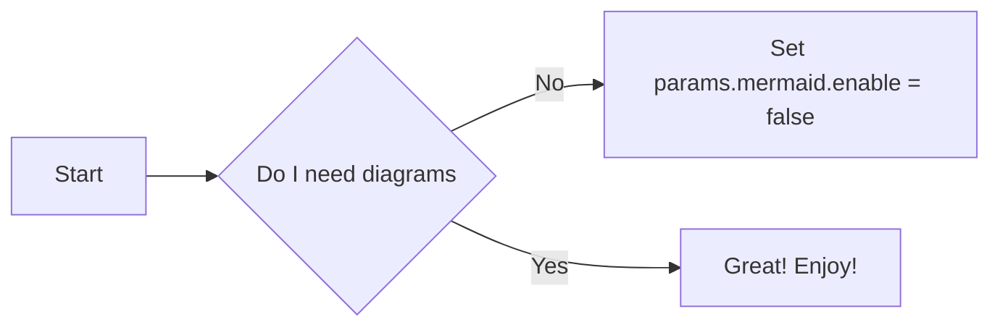

Docsy has built-in support for a number of diagram creation and typesetting tools you can use to add rich content to your site, including \\(\KaTeX\\), Mermaid, Diagrams.net, PlantUML, and MarkMap.

## \\(\LaTeX\\) support with \\(\KaTeX\\)

[\\(\LaTeX\\)](https://www.latex-project.org/) is a high-quality typesetting system for the production of technical and scientific documentation. Due to its excellent math typesetting capabilities, \\(\TeX\\) became the de facto standard for the communication and publication of scientific documents, especially if these documents contain a lot of mathematical formulae. Designed and mostly written by Donald Knuth, the initial version was released in 1978. Dating back that far, \\(\LaTeX\\) has `pdf` as its primary output target and is not particularly well suited for producing HTML output for the Web. Fortunately, with [\\(\KaTeX\\)](https://katex.org/) there exists a fast and easy-to-use JavaScript library for \\(\TeX\\) math rendering on the web, which was integrated into the Docsy theme.

With \\(\KaTeX\\) support enabled in Docsy, you can include complex mathematical formulae into your web page, either inline or centred on its own line. Since \\(\KaTeX\\) relies on server side rendering, it produces the same output regardless of your browser or your environment. Formulae can be shown either inline or in display mode:

### Inline formulae

The following code sample produces a text line with three inline formulae:

```tex
When \\(a \ne 0\\), there are two solutions to \\(ax^2 + bx + c= 0\\) and they are \\(x = {-b \pm \sqrt{b^2-4ac} \over 2a}.\\)
```

When \\(a \ne 0\\), there are two solutions to \\(ax^2 + bx + c= 0\\) and they are \\(x = {-b \pm \sqrt{b^2-4ac} \over 2a}.\\)

### Formulae in display mode

The following code sample produces an introductory text line followed by a formula numbered as `(1)` residing on her own line:

```tex
The probability of getting \\(k\\) heads when flipping \\(n\\) coins is:
$$\tag*{(1)} P(E) = {n \choose k} p^k (1-p)^{n-k}$$
```

The probability of getting \\(k\\) heads when flipping \\(n\\) coins is:
$$\tag*{(1)}  P(E) = {n \choose k} p^k (1-p)^{n-k}$$

{}
This [wiki page](https://en.wikibooks.org/wiki/LaTeX/Mathematics) provides in-depth information about typesetting mathematical formulae using the \\(\LaTeX\\) typesetting system.
{}

### Enabling and configuring \\(\LaTeX\\) support

To enable/disable \\(\KaTeX\\) support inside the Docsy theme, update `config.toml`:

```toml
[params.katex]
enable = true
```

Additionally, you can customize various \\(\KaTeX\\) options inside `config.toml`, if needed:

```toml
[params.katex]
# enable/disable KaTeX support
enable = true
# Element(s) scanned by auto render extension. Default: document.body
html_dom_element = "document.body"

[params.katex.options]
# If true (the default), KaTeX will throw a ParseError when it encounters an
# unsupported command or invalid LaTeX. If false, KaTeX will render unsupported
# commands as text, and render invalid LaTeX as its source code with hover text
# giving the error, in the color given by errorColor.
throwOnError = false
errorColor = "#CD5C5C"

# This is a list of delimiters to look for math, processed in the same order as
# the list. Each delimiter has three properties:
#   left:    A string which starts the math expression (i.e. the left delimiter).
#   right:   A string which ends the math expression (i.e. the right delimiter).
#   display: Whether math in the expression should be rendered in display mode.
[[params.katex.options.delimiters]]
  left = "$$"
  right = "$$"
  display = true
[[params.katex.options.delimiters]]
  left = "$"
  right = "$"
  display = false
[[params.katex.options.delimiters]]
  left = "\\("
  right = "\\)"
  display = false
[[params.katex.options.delimiters]]
  left = "\\["
  right = '\\]'
  display = true
```

For a complete list of options and their detailed description, have a look at the documentation of \\({\KaTeX}'s\\) [Rendering API options](https://katex.org/docs/autorender.html#api) and of \\({\KaTeX}'s\\) [configuration options](https://katex.org/docs/options.html).

### Display of Chemical Equations and Physical Units

[mhchem](https://www.ctan.org/pkg/mhchem) is a \\(\LaTeX\\) package for typesetting chemical molecular formulae and equations. Fortunately, \\(\KaTeX\\) provides the `mhchem` [extension](https://github.com/KaTeX/KaTeX/tree/master/contrib/mhchem) that makes the `mhchem` package accessible when authoring content for the web. Since this extension was integrated into the Docsy theme, you can write beautiful chemical equations easily once `mhchem` support is enabled inside your `config.toml`:

```toml
[params.katex]
enable = true

[params.katex.mhchem]
enable = true
```

With `mhchem` extension enabled, you can easily include chemical equations into your page. The equations can be shown either inline or can reside on its own line. The following code sample produces a text line including a chemical equation:

```mhchem
*Precipitation of barium sulfate:* \\(\ce{SO4^2- + Ba^2+ -> BaSO4 v}\\)
```

*Precipitation of barium sulfate:* \\(\ce{SO4^2- + Ba^2+ -> BaSO4 v}\\)

More complex equations, like the one shown in the code sample below, should be displayed on their own line:

```mhchem
$$\tag*{(2)} \ce{Zn^2+  <=>[+ 2OH-][+ 2H+]  $\underset{\text{amphoteric hydroxide}}{\ce{Zn(OH)2 v}}$  <=>[+ 2OH-][+ 2H+]  $\underset{\text{tetrahydroxozincate}}{\ce{[Zn(OH)4]^2-}}$}$$
```

$$\tag*{(2)} \ce{Zn^2+  <=>[+ 2OH-][+ 2H+]  $\underset{\text{amphoteric hydroxide}}{\ce{Zn(OH)2 v}}$  <=>[+ 2OH-][+ 2H+]  $\underset{\text{tetrahydroxozincate}}{\ce{[Zn(OH)4]^2-}}$}$$

{}
The [manual](https://mhchem.github.io/MathJax-mhchem/) for mchem’s input syntax provides in-depth information about typesetting chemical formulae and physical units using the `mhchem` tool.
{}

Use of `mhchem` is not limited to the authoring of chemical equations, using the included `\pu` command, pretty looking physical units can be written with ease, too. The following code sample produces two text lines with four numbers plus their corresponding physical units:

```mhchem
* Scientific number notation: \\(\pu{1.2e3 kJ}\\) or \\(\pu{1.2E3 kJ}\\) \\
* Divisions: \\(\pu{123 kJ/mol}\\) or \\(\pu{123 kJ//mol}\\)
```

* Scientific number notation: \\(\pu{1.2e3 kJ}\\) or \\(\pu{1.2E3 kJ}\\)
* Divisions: \\(\pu{123 kJ/mol}\\) or \\(\pu{123 kJ//mol}\\)

For a complete list of options when authoring physical units, have a look at the [section](https://mhchem.github.io/MathJax-mhchem/#pu) on physical units in the `mhchem` documentation.

## Diagrams with Mermaid

[Mermaid](https://mermaid-js.github.io) is a Javascript library for rendering simple text definitions to useful diagrams in the browser.  It can generate a variety of different diagram types, including flowcharts, sequence diagrams, class diagrams, state diagrams, ER diagrams, user journey diagrams, Gantt charts and pie charts.

With Mermaid support enabled in Docsy, you can include the text definition of a Mermaid diagram inside a code block, and it will automatically be rendered by the browser as soon as the page loads.

The great advantage of this is anyone who can edit the page can now edit the diagram - no more hunting for the original tools and version to make a new edit.

For example, the following defines a simple flowchart:

````

````

Automatically renders to:


To enable/disable Mermaid, update `config.toml`:

```toml
[params.mermaid]
enable = true
```

You also need to disable the `guessSyntax` from markup highlighting in `config.toml`  for Mermaid to work:

```toml
[markup]
  [markup.highlight]
      guessSyntax = "false"
```

You can also update settings for Mermaid, such as themes, padding, etc:

```toml
[params.mermaid]
enable = true
theme = "neutral"

[params.mermaid.flowchart]
diagramPadding = 6
```

See the [Mermaid documentation](https://mermaid-js.github.io/mermaid/#/Setup?id=mermaidapi-configuration-defaults) for a list of defaults that can be overridden.

Settings can also be overridden on a per-diagram basis by making use of the `%%init%%` header at the start of the diagram definition.  See the [Mermaid theming documentation](https://mermaid-js.github.io/mermaid/#/theming?id=themes-at-the-local-or-current-level).

## UML Diagrams with PlantUML

[PlantUML](https://plantuml.com/en/) is an alternative to Mermaid that lets you quickly create UML diagrams, including sequence diagrams, use case diagrams, and state diagrams. Unlike Mermaid diagrams, which are entirely rendered in the browser, PlantUML uses a PlantUML server to create diagrams. You can use the provided default demo server (not recommended for production use), or run a server yourself. PlantUML offers a wider range of image types than Mermaid, so may be a better choice for some use cases.

Diagrams are defined using a simple and intuitive language. ([see PlantUML Language Reference Guide](https://plantuml.com/en/guide)).

The following example shows a use case diagram:

````
```plantuml
participant participant as Foo
actor       actor       as Foo1
boundary    boundary    as Foo2
control     control     as Foo3
entity      entity      as Foo4
database    database    as Foo5
collections collections as Foo6
queue       queue       as Foo7
Foo -> Foo1 : To actor 
Foo -> Foo2 : To boundary
Foo -> Foo3 : To control
Foo -> Foo4 : To entity
Foo -> Foo5 : To database
Foo -> Foo6 : To collections
Foo -> Foo7: To queue
```
````

Automatically renders to:

```plantuml
participant participant as Foo
actor       actor       as Foo1
boundary    boundary    as Foo2
control     control     as Foo3
entity      entity      as Foo4
database    database    as Foo5
collections collections as Foo6
queue       queue       as Foo7
Foo -> Foo1 : To actor 
Foo -> Foo2 : To boundary
Foo -> Foo3 : To control
Foo -> Foo4 : To entity
Foo -> Foo5 : To database
Foo -> Foo6 : To collections
Foo -> Foo7: To queue
```

To enable/disable PlantUML, update `config.toml`:

```
[params.plantuml]
enable = true
```

Other optional settings are:
```
[params.plantuml]
enable = true
theme = "default"

#Set url to plantuml server 
#default is http://www.plantuml.com/plantuml/svg/
svg_image_url = "https://www.plantuml.com/plantuml/svg/"

```

## MindMap support with MarkMap

[MarkMap](https://markmap.js.org/) is a Javascript library for rendering simple text definitions to MindMap in the browser.

For example, the following defines a simple MindMap:

````
```markmap
# markmap

## Links

- <https://markmap.js.org/>
- [GitHub](https://github.com/gera2ld/markmap)

## Related

- [coc-markmap](https://github.com/gera2ld/coc-markmap)
- [gatsby-remark-markmap](https://github.com/gera2ld/gatsby-remark-markmap)

## Features

- links
- **inline** ~~text~~ *styles*
- multiline
  text
- `inline code`
-
    ```js
    console.log('code block');
    ```
- Katex - $x = {-b \pm \sqrt{b^2-4ac} \over 2a}$
```
````

Automatically renders to:

```markmap
# markmap

## Links

- <https://markmap.js.org/>
- [GitHub](https://github.com/gera2ld/markmap)

## Related

- [coc-markmap](https://github.com/gera2ld/coc-markmap)
- [gatsby-remark-markmap](https://github.com/gera2ld/gatsby-remark-markmap)

## Features

- links
- **inline** ~~text~~ *styles*
- multiline
  text
- `inline code`
-
    ```js
    console.log('code block');
    ```
- Katex - $x = {-b \pm \sqrt{b^2-4ac} \over 2a}$
```

To enable/disable MarkMap, update `config.toml`:

```toml
[params.markmap]
enable = true
```

## Diagrams with Diagrams.net

[Diagrams.net](https://diagrams.net/) (aka draw.io) provides a free and open source diagram editor that can generate a wider range of diagrams than Mermaid or PlantUML using a web or desktop editor.

SVG and PNG files exported with the tool contain the source code of the original diagram by default, which allows  the diagrams.net site to import those images again for edit in the future.  Docsy can detect this and automatically add an "edit" button over any image that can be edited using the online site.

Hover over the image below and click edit to instantly start working with it.  Clicking the "Save" button will cause the edited diagram to be exported using the same filename and filetype, and downloaded to your browser.

{}
If you're creating a new diagram, be sure to File -> Export in either svg or png format (svg is usually the best choice) and ensure the "Include a copy of my diagram" is selected so it can be edited again later.
{}

As the diagram data is transported via the browser, the diagrams.net server does not need to access the content on your Docsy server directly at all.




To disable detection of diagrams, update `config.toml`:

```toml
[params.drawio]
enable = false
```

You can also [deploy and use your own server](https://github.com/jgraph/docker-drawio/blob/master/README.md) for editing diagrams, in which case update the configuration to point to that server:

```toml
[params.drawio]
drawio_server = "https://app.mydrawioserver.example.com"
```
